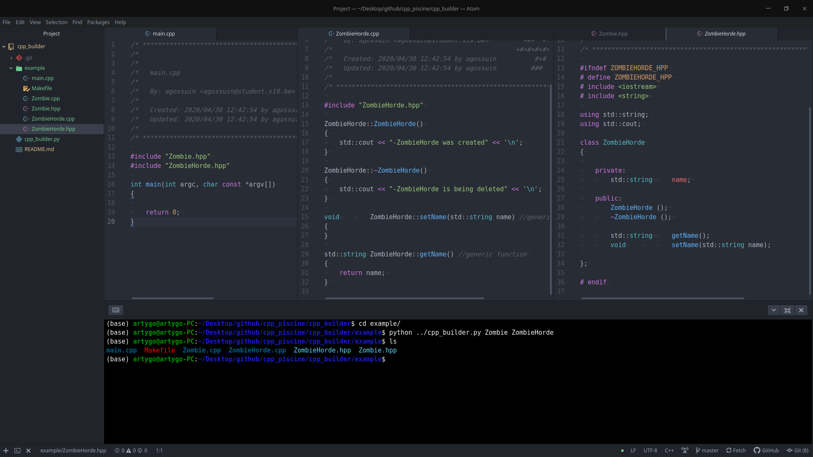

# cpp_builder

generates cpps, hpps, main, Makefile with given ClassNames.

## Example Usage

First change the OWNER variable with your school pseudo (line 8) default school is 19 but you can change it.

to generate cpp files templates :
Makefile - main.cpp - Zombie.cpp - Zombie.hpp - ZombieHorde.cpp - ZombieHorde.hpp

```bash
$> git clone https://github.com/Artygo8/cpp_builder.git
$> mkdir example
$> cd example
$> python ../cpp_builder Zombie ZombieHorde
```

(use 'python3' instead of 'python' if not sure)

# Troubleshooting

Be aware that it wont overwrite (and wont work at all) if there already is a main in your directory.
So just delete or move it while using the cpp_builder.

This builder uses python3.

Do not hesitate to contact me.

## Screenshot



## Special Thanks

I have to mention [Lorenuar](https://github.com/lorenuars19) for his beautiful [Makefile](https://github.com/lorenuars19/makefile-template.git) template that inspired me quite alot...

## Contact

Do not hesitate to contact me through the 42 network or using my email address `agossuinATstudent.s19.be`
