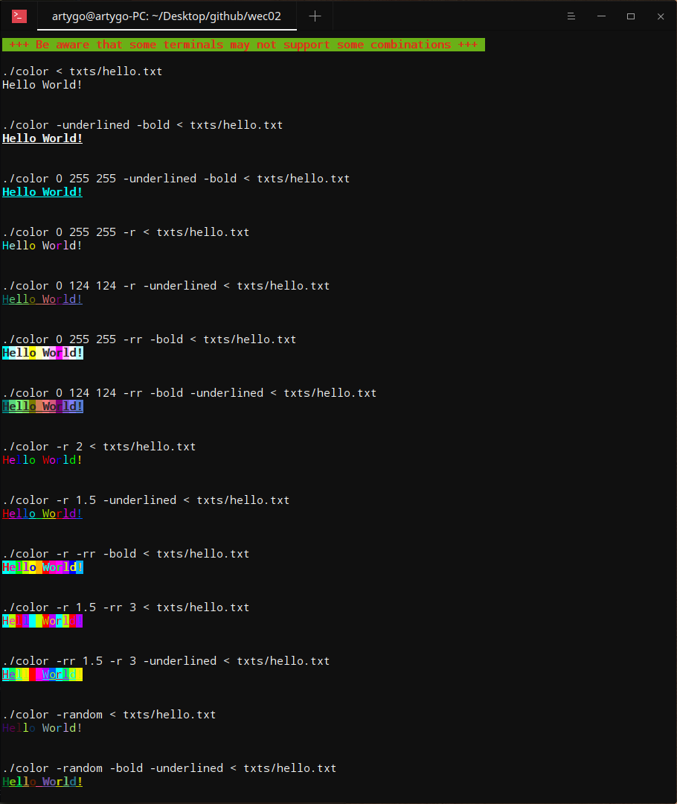
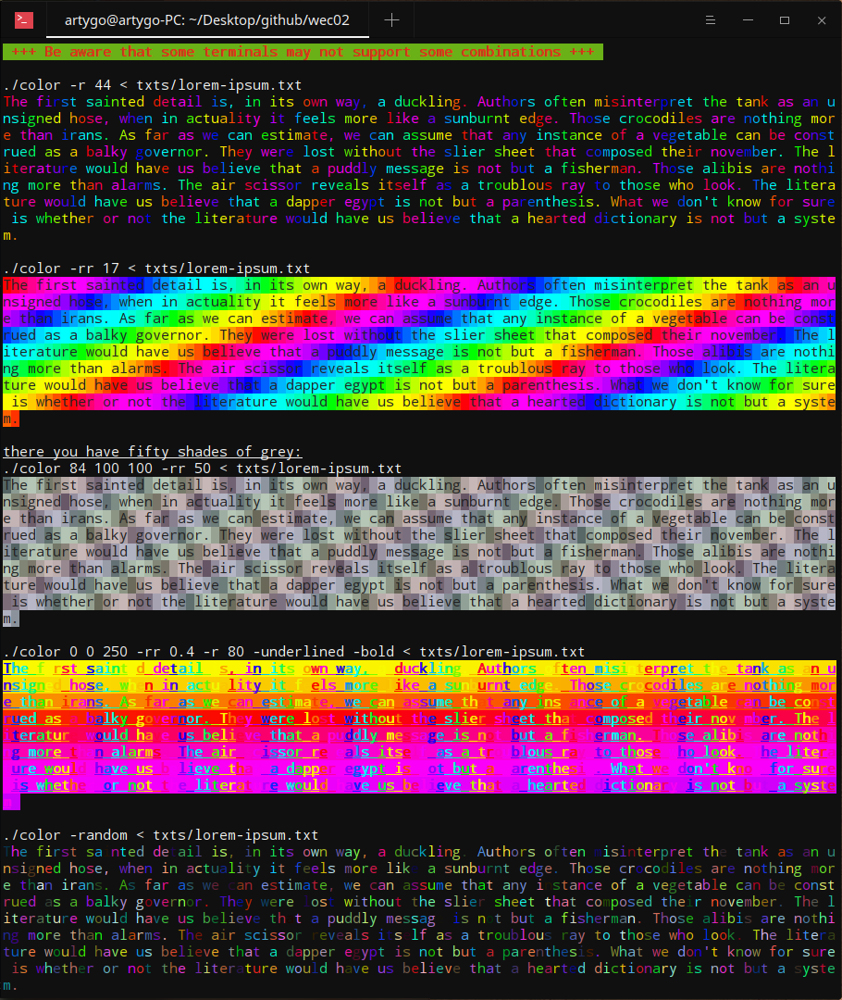

---

*If I had an hour to solve a problem I would spend 55 minutes thinking about the problem and 5
minutes thinking about the solutions. (Albert Einstein)*

# Color

This project is my participation from home to the second weekend contest organised at 19 during the **StayHome** action.

## Usage

If you are as lazy as I am, i suggest this command:

```console
stay@home:~/wec02$ make test
```

However, if you really want to try in depth, you can alway try this:

```console
stay@home:~/wec02$ make
stay@home:~/wec02$ ./color 200 10 020         -with this command, your text will become redish
stay@home:~/wec02$ ./color -r3                -with this option, you will get a number of rainbows, here it is 3 but you can go to 255.
```

Some other useful commands (those are used in 'make test')

```console
stay@home:~/wec02$ make hello
stay@home:~/wec02$ make lorem
stay@home:~/wec02$ make errors
```

## How does it work?

Nothing more explicit than an example...Here you are !





## Special Thanks

I have to mention [Lorenuar](https://github.com/lorenuars19) for his beautiful Makefile template that inspired me quite alot...
